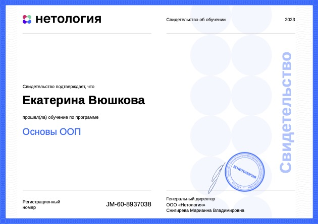

# Java developer trainee

Hello dears! Thank you for looking at my portfolio, where I will be happy to share my skills and achievements to date

1. **Computer science**:
- working with computer and network
  - CPU
  - memory (RAM)
  - data store
  - net 
  - motherboard
- OSI model
- Protocols TCP/UDP
- Ports
- Logical operations and algorithms 
- Client-server interaction 
  - IP
  - DNS
  - LAN/ VAN /WLAN
  - HTTP/ HTTPS 
  - Mac OC/ Linux/ Windows
2. **Java basics**
- program structure
- Java logical operators
- loop statements: 
  - if 
  - switch 
  - while 
  - for 
  - do while 
  - foreach 
- recursive functions
- JVM, JRE, JDK
- variables and constants
- data types in Java (primitives - int, byte, long, short and float, double and boolean and char; reference - String, Enum)
- Console I/O in Java
- arithmetic operations
- Basic Data Type Conversions
- conditionals

3. **Classes. Object-oriented programming**
- classes and objects, packages
- access modifiers (public, private, protected)
- Objects - as method parameters; Inner and nested classes
- inheritance and generalization
- generics
- data structures in Java (arrays (one-dimensional, multidimensional), stack, queue, Linkes list, three, graphs)
- class structure (fields, methods, constructors)
- static members and the static modifier
- OOP basics (access modifiers, inheritance, encapsulation, polymorphism, abstractions and interfaces)

4. **Exception Handling**
- throw
-  error class hierarchy
- сreating your own exception classes

5. **Collections** 
- class Array List and interfase List
- Queue and class ArrayDeque
- class LinkedList
- Interface Set and class HashSet
- SortedSet, NavigableSet, TreeSet
- Interfaces Copmparable, Comparator
- Interface Map and class HashMap
- class TreeMap
- Interface Iterator
- Deque and Stack

6. **Working with Strings**
- String builder

7. **GIT - version control system**
- Git global settings
- working with the command line, 
- git commands (init, status, add, commit, rm -rf, log, diff, checkout,  branch, clone, push, pull, revert) and other (rwd, cd, ls -la)
- creating local and remote repositories (GitHub) creating an SSH key
- branching in Git: working with branches, merging, resolving merge conflicts
- Fork and cloning a repository
- tools for updating a project in Git/GitHub
- setting ignore in Git (.gitignore)
- Issues, pull request, GitHub Pages

Currently I have a certificate of successful study of: 
- _**"Fundamentals of OOP"**_\

- _**"Java basics"**_\

- _**"GIT - version control system"**_\

I also successfully implemented the first course project "Converter to text graphics" [myConverter](https://github.com/SonyaRubenstein/myConverter) 